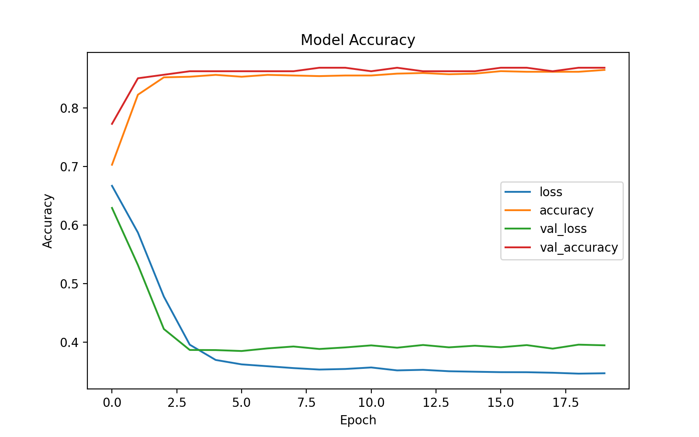

# Tutorial 1

### Directions

1. make sure you have python3 installed on your computer
2. download the repository
3. `pip3 install -r requirements.txt`
    - this will install the necessary AI libraries on your computer
4. python3 main.py

